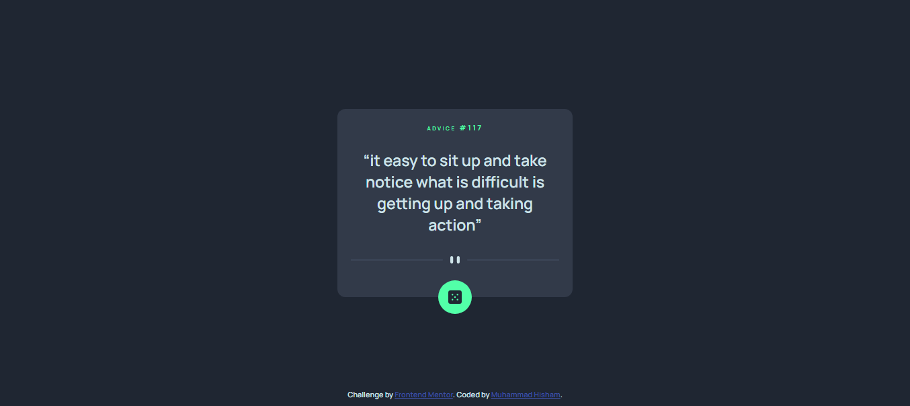

# Frontend Mentor - Advice generator app solution

This is a solution to the [Advice generator app challenge on Frontend Mentor](https://www.frontendmentor.io/challenges/advice-generator-app-QdUG-13db). Frontend Mentor challenges help you improve your coding skills by building realistic projects.

## Table of contents

- [Overview](#overview)
  - [The challenge](#the-challenge)
  - [Screenshot](#screenshot)
  - [Links](#links)
- [My process](#my-process)
  - [Built with](#built-with)
  - [What I learned](#what-i-learned)
  - [Useful resources](#useful-resources)
- [Author](#author)


## Overview

### The challenge

Users should be able to:

- View the optimal layout for the app depending on their device's screen size
- See hover states for all interactive elements on the page
- Generate a new piece of advice by clicking the dice icon

### Screenshot



### Links

- Live Site URL: [Add live site URL here](https://your-live-site-url.com)

## My process

### Built with

- Semantic HTML5 markup
- CSS custom properties
- CSS Grid
- JavaScript
- Mobile-first workflow


### What I learned

i learned how to fetch data from api using async function, fetch method.

To see how you can add code snippets, see below:

```js
const name = async function () {
    const res = await fetch("API");
    try {
        const data = await res.json();
        return data;
    } catch (error) {
        console.log(error);
    }
}
```

### Useful resources

- [Asynchronous Function](https://developer.mozilla.org/en-US/docs/Web/JavaScript/Reference/Statements/async_function) - This helped me for understanding how to use async functions
- [Fetch Method](https://developer.mozilla.org/en-US/docs/Web/API/fetch) - This is an amazing article which helped me finally understand Fetch Method. 


## Author

- Frontend Mentor - [@mohamedhesham221](https://www.frontendmentor.io/profile/mohamedhesham221)
- Linkedin - [Muhammad Hisham](https://www.linkedin.com/in/muhammad-hisham-23544b253/)
